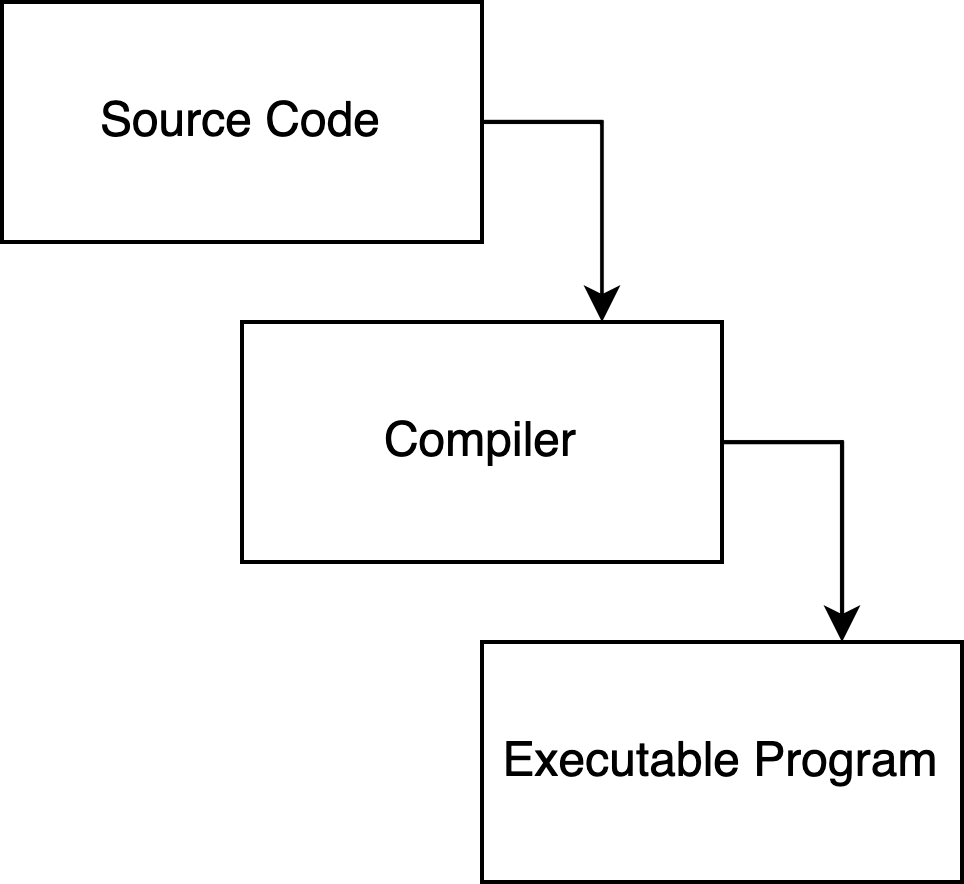

-> START PAGE

# Welcome

This tool will take you through some of the basics of Rust, and give you the chance to write some code yourself and see it running on the machine.

Firstly, let's get you introduced to this tool. On the right hand side of the page you can see a terminal window, this is how we're going to be compiling our code and seeing the output of our commands. The terminal window is running in a Linux environment so whatever commands work there will work here too (but don't worry if you don't know any, we'll be able to help!)

Let's get used to using the terminal now, try the command `ls -al`!

-> COMMANDWAIT ls -al
-> END PAGE

-> START PAGE
-> INCLUDEFILE helloworld.rs

# Hello, World!

Before we dig into writing some code, let's take a look at a Rust program that's on the machine and see how we can turn our code in a file into something that we can actually run.

Rust is a compiled language, meaning we need to follow the process below:



There is a file in the current directory called `helloworld.rs`, we're going to take this file, compile it, and then run it.

Firstly let's run `rustc helloworld.rs` to compile the file!

-> COMMANDWAIT rustc helloworld.rs
-> END PAGE
-> START PAGE

# Hello, World!

Awesome, the file is now compiled into an executable, let's run the executable and see the command output.

Run `./helloworld`

-> CHECKCOMMANDOUT Hello, World!
-> END PAGE

-> START PAGE
-> EXECCOMMAND touch name.rs

# Let's write some code

Now we've understood the basic cycle of writing code -> compiling code -> running code. Let's open one of the Rust files and get our hands on with the code. In Visual Studio Code there ia file called `name.rs`, we're going to use this Rust file to print our name to the console.

Copy and paste the following code, changing your name into the content:

```
fn main() {
  let name = "<Your Name!>";
  println!("Hi {}, you're looking very nice today!", name);
}
```

Once you've done that, let's compile the file and then run it to see our name in the Console. Let's run `rustc name.rs`

-> COMMANDWAIT rustc name.rs
-> CHECKCOMMANDOUT looking very nice today
-> END PAGE